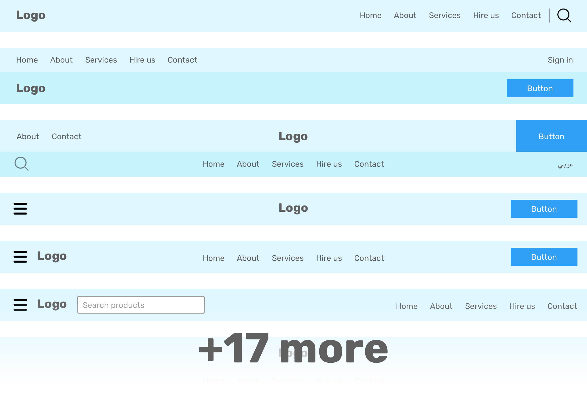

# Introducing Headers.css

I got the idea of designing and implementing a blueprint website header components. The reason is that I can pick one and use it for a new project pretty quickly. I made 17 headers so far and aiming for more in the coming weeks. You can [check them out](https://headers-css.vercel.app/) here.

[Read about building headers with flexbox](https://ishadeed.com/article/website-headers-flexbox/) on my blog.

While working on them, I tried to focus on the following:

- Simplicity
- Fully responsive design
- Used Sass so they can be easily edited (Still need to do some refactoring here and there)
- Accessibility (Please open an issue if you spot something incorrectly)

## How To Use

I didn't build this project with a "smart" way to get the files. For now, you can get the HTML, Sass, and Javascript related for the header you want to check. I will try to enhance this.

## Todo

- [ ] Think about a build process
- [ ] RTL Styling

## Contributions

Oh, that would be great and very nice of you. Please submit an issue to discuss or simply add a PR.

## Issues

Spotted a bug or something weird? Please [open an issue](https://github.com/shadeed/headers-css/issues). Thank you!
